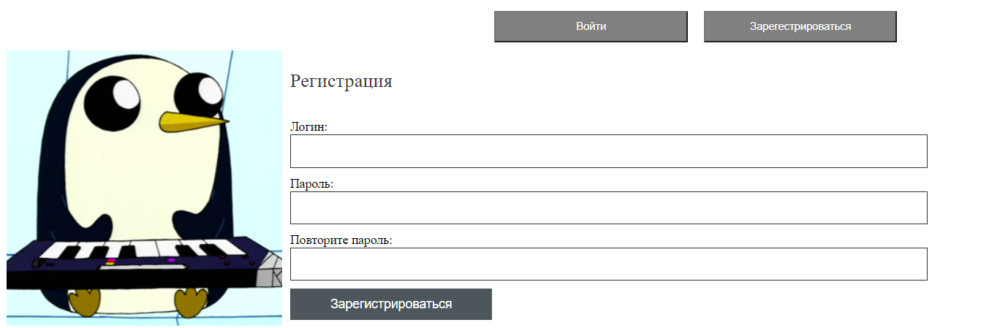
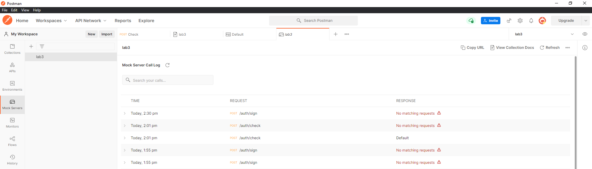
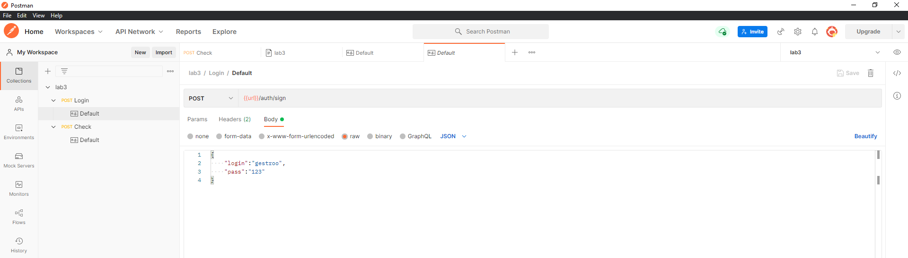
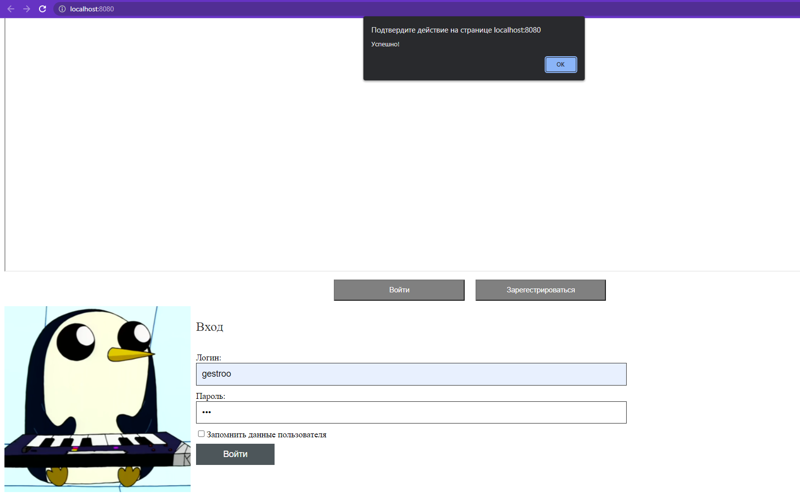
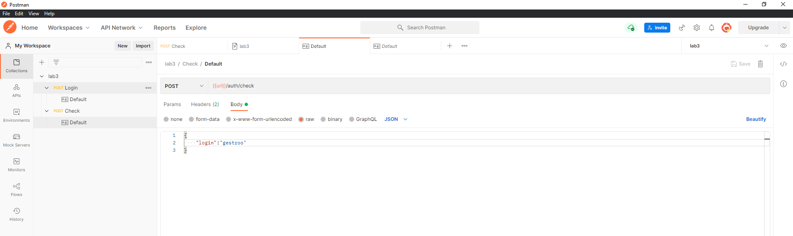
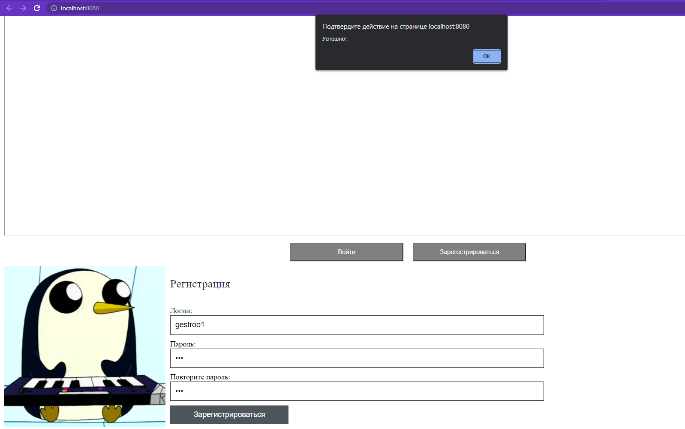
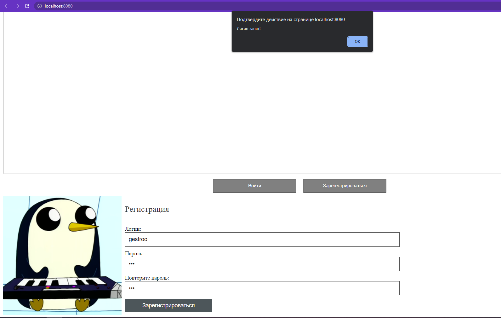

<p align = center>МИНИСТЕРСТВО НАУКИ И ВЫСШЕГО ОБРАЗОВАНИЯ

<p align = center>РОССИЙСКОЙ ФЕДЕРАЦИИ

<p align = center>ФЕДЕРАЛЬНОЕ ГОСУДАРСТВЕННОЕ БЮДЖЕТНОЕ ОБРАЗОВАТЕЛЬНОЕ УЧРЕЖДЕНИЕ ВЫСШЕГО ОБРАЗОВАНИЯ

<p align = center>«ВЯТСКИЙ ГОСУДАРСТВЕННЫЙ УНИВЕРСИТЕТ»

<p align = center>Институт математики и информационных систем

<p align = center>Факультет автоматики и вычислительной техники

<p align = center>Кафедра систем автоматизации управления
<br>
<br>
<br>
<br>

<p align = right>Дата сдачи на проверку:

<p align = right>«___» __________ 2022 г.

<p align = right>Проверено:

<p align = right>«___» __________ 2022 г.
<br>
<br>
<br>
<br>
<br>


<p align = center>Отчет по лабораторной работе № 3

<p align = center>по дисциплине

<p align = center>«Web-программирование»

<br>
<br>
<br>
<br>


<p align = center>Разработал студент гр. ИТб-2301-01-00 ________________ /Широков Д.Р./

<p align = center>Проверил ст. преподаватель _________________ /Земцов М.А./

<p align = center>Работа защищена с оценкой «___________» «___» __________ 2022 г.

<br>
<br>
<br>
<br>

<p align = center>Киров 2022

<hr>
Цель:  провести тестирование отправки axios-запроса на mock-сервер

Задачи:

1. Организовать процесс работы над лабораторной работой
1. Сверстать блок регистрации
1. Создать mock-сервер в Postman
1. Отправить запрос на mock-сервер и получить ответ

Ход выполнения:

1. Организовать процесс работы над лабораторной работой

Для работы в репозитории *[ссылка на репозиторий](https://github.com/Gestroo/Web)* на сайте github.com была создана новая ветвь с названием lab3 от ветки lab2.

2. Сверстать блок регистрации

В компонент Registration была добавлена адаптивная верстка блока регистрации. Результут представлен на рисунке 1 и 2.

<p align=center></p>

<p align = center>Рисунок 1 – Регистрация desktop

<p align=center></p>

<p align = center>Рисунок 2 – Регистрация для мобильных устройств

3. Создать mock-сервер в Postman

В ходе выполнения работы с помощью Postman был создан Mock Server. Созданный Mock Server представлен на рисунке 3. 

<p align=center></p>

<p align = center>Рисунок 3 – Mock Server

В рамках лабораторной работы были созданы два Post запроса.
В первом случае Post запрос используется для проверки введенного логина и пароля. Реализация запроса изображена на рисунке 4. Результаты его работы показаны на рисунках 5 и 6.

<p align=center></p>

<p align = center>Рисунок 4 – Post запрос

<p align=center></p>

<p align = center>Рисунок 5 – Удачный вход

<p align=center></p>

<p align = center>Рисунок 6 – Неудачный вход

Во втором случае Post запрос используется для проверки уникальности логина при регистрации. Реализация запроса изображена на рисунке 7. Результаты его работы показаны на рисунках 8 и 9.

<p align=center></p>

<p align = center>Рисунок 7 – Post запрос

<p align=center></p>

<p align = center>Рисунок 8 – Удачная регистрация

<p align=center></p>

<p align = center>Рисунок 9 – Неудачная регистрация

В компоненте Register предусмотрена проверка на ввод  пароля и совпадения введенных паролей
Листинг компонента Register представлен в приложении А.

Вывод: в ходе лабораторной работы было проведено тестирование отправки axios-запроса на mock-сервер.

<p align = center>Приложение А

<p align = center>(обязательное) 

<p align = center>Листинг компонента Register.vue

```html
<template>
  <div class="form-div">
    
    <form class="form">
      
      <h3 class="form_title">Регистрация</h3>
      <div >
        <div class="mobile-login">
          <input type="text" class="form_input" placeholder="Логин" />
        </div>
        <div class="checkbox mobile-login" >
          <input type="password" class="form_input" placeholder="Пароль" />
        </div>
        <div class="checkbox mobile-login" >
          <input type="password" class="form_input" placeholder="Повторите пароль" />
        </div>
        <div class="desktop-login">
          <span>Логин:</span>
          <input type="text" class="form_input" id="login" />
        </div>
        <div class="checkbox desktop-login" >
          <span>Пароль:</span>
          <input type="password" class="form_input" id="pass1" />
        </div>
        <div class="checkbox desktop-login" >
          <span>Повторите пароль:</span>
          <input type="password" class="form_input" id="pass2" />
        </div>
        <div >
          <button type="button" v-on:click="signOn" class="form_btn">Зарегистрироваться</button>
        </div>
      </div>
    </form>
  </div>
</template>

<script lang="ts">
import axios from 'axios';

export default ({
  methods: {
    signOn() {
      const log :HTMLInputElement = document.getElementById('login') as HTMLInputElement;
      const pass1 :HTMLInputElement = document.getElementById('pass1') as HTMLInputElement;
      const pass2 :HTMLInputElement = document.getElementById('pass2') as HTMLInputElement;
      const config = {
        url: 'https://6ed89820-054b-4d52-b92a-2d2cfe0744e1.mock.pstmn.io/auth/check',
      };
      const data = {
        login: log.value,
      };
      if (log.value === '') {
        alert('Введите логин!');
        return;
      }
      if (pass1.value === '') {
        alert('Введите пароль!');
        return;
      }
      if (pass1.value !== pass2.value) {
        alert('Пароли не совпадают!');
        return;
      }
      axios.post(config.url, data, { headers: { 'x-mock-match-request-body': true } })
        .then((response) => {
          console.log(response.data.isRequire);
          if (response.data.isRequire) {
            alert('Логин занят!');
          }
        })
        .catch((error) => {
          console.log(error);
          alert('Успешно!');
        });
    },
  },
});
</script>

<style>
.form-div {
  margin-top:100px;
  display: flex;
}
.logo_big {
  width: 40%;
  background: #444;
}
.logo {
  display: none;
  width: 20%;
  padding-top: 10px;
}
.form {
  display: flex;
  flex-direction: column;
  width: 50%;
  margin-left: 10px;
}
.form_title {
  font-size: 1.5rem;
  font-weight: 500;
  color: #333;
}
.form_input {
  width: 90%;
  padding: 10px;
  border: solid 1px #333;
  font-size: inherit;
}
.checkbox {
  margin: 7px 0;
}
.desktop-login
{
  display: flex;
  margin:10px 0;
  flex-direction: column;
}
.mobile-login{
  display:none;
}
.form_btn {
  border: none;
  cursor: pointer;
  font-size: inherit;
  background-color: #4d565a;
  color: #fff;
  padding: 10px 50px;
}
@media (max-width: 768px) {
  .form {
    width: 100%;
    align-items: center;
  }
  .checkbox-text{
    font-size: 32px;
  }
  .form-div {
    width: 100%;
    height: 300px;
  }
  .form_btn
  {
    width: 100%;
    font-size: 32px;
    padding: 20px 100px;
  }
  .form_title {
    font-size: 48px;
  }
  .logo_big {
    display: none;
  }
  .logo {
    display: flex;
  }
  .mobile-login
  {
   display: flex;
    width: 100%;
  }
  .form_input {
    font-size: 32px;
  }
  .desktop-login
  {display: none;}
}
@media (max-width: 480px) {
  .logo {
    width: 50%;
  }
  .form-div {
     width: 100%;
  }
}
```
<p align = center>Приложение Б

<p align = center>(обязательное) 

<p align = center>Листинг компонента Login.vue

```
<template>
  <div class="form-div">
    
    <form class="form">
      
      <h3 class="form_title">Вход</h3>
      <div >
        <div class="mobile-login">
          <input type="text" class="form_input" placeholder="Логин" />
        </div>
        <div class="checkbox mobile-login" >
          <input type="password" class="form_input" placeholder="Пароль" />
        </div>
        <div class="desktop-login">
          <span>Логин:</span>
          <input id="log" type="text" class="form_input" />
        </div>
        <div class="checkbox desktop-login" >
          <span>Пароль:</span>
          <input id="pass" type="password" class="form_input" />
        </div>
        <div class="checkbox">
          <input type="checkbox" id="input" />
          <label class="checkbox-text" for="input">Запомнить данные пользователя</label>
        </div >
        <div >
          <button type="button" class="form_btn" v-on:click="signIn">Войти</button>
        </div>
      </div>
    </form>
  </div>
</template>

<script lang="ts">
import axios from 'axios';

export default {
  methods: {
    signIn() {
      const login :HTMLInputElement = document.getElementById('log') as HTMLInputElement;
      const pass :HTMLInputElement = document.getElementById('pass') as HTMLInputElement;

      const config = {
        url: 'https://6ed89820-054b-4d52-b92a-2d2cfe0744e1.mock.pstmn.io/auth/sign',
      };
      const data = {
        login: login.value,
        pass: pass.value,
      };
      axios.post(config.url, data, { headers: { 'x-mock-match-request-body': true } })
        .then((response) => {
          console.log(response.data.isRequire);
          if (response.data.isRequire) {
            alert('Успешно!');
          }
        })
        .catch((error) => {
          console.log(error);
          alert('Неверный логин или пароль!');
        });
    },
  },
};
</script>

<style>
.form-div {
  display: flex;
}
.logo_big {
  width: 20%;
  background: #444;
}
.logo {
  display: none;
  width: 20%;
  padding-top: 10px;
}
.form {
  display: flex;
  flex-direction: column;
  width: 50%;
  margin-left: 10px;
}
.form_title {
  font-size: 1.5rem;
  font-weight: 500;
  color: #333;
}
.form_input {
  width: 90%;
  padding: 10px;
  border: solid 1px #333;
  font-size: inherit;
}
.checkbox {
  margin: 7px 0;
}
.desktop-login
{
  display: flex;
  margin:10px 0;
  flex-direction: column;
}
.mobile-login{
  display:none;
}
.form_btn {
  border: none;
  cursor: pointer;
  font-size: inherit;
  background-color: #4d565a;
  color: #fff;
  padding: 10px 50px;
}
@media (max-width: 768px) {
  .form {
    width: 100%;
    align-items: center;
  }
  .checkbox-text{
    font-size: 32px;
  }
  .form-div {
    width: 100%;
    height: 300px;
  }
  .form_btn
  {
    width: 100%;
    font-size: 32px;
    padding: 20px 100px;
  }
  .form_title {
    font-size: 48px;
  }
  .logo_big {
    display: none;
  }
  .logo {
    display: flex;
  }
  .mobile-login
  {
   display: flex;
    width: 100%;
  }
  .form_input {
    font-size: 32px;
  }
  .desktop-login
  {display: none;}
}
@media (max-width: 480px) {
  .logo {
    width: 50%;
  }
  .form-div {
     width: 100%;
  }
}
</style>
```