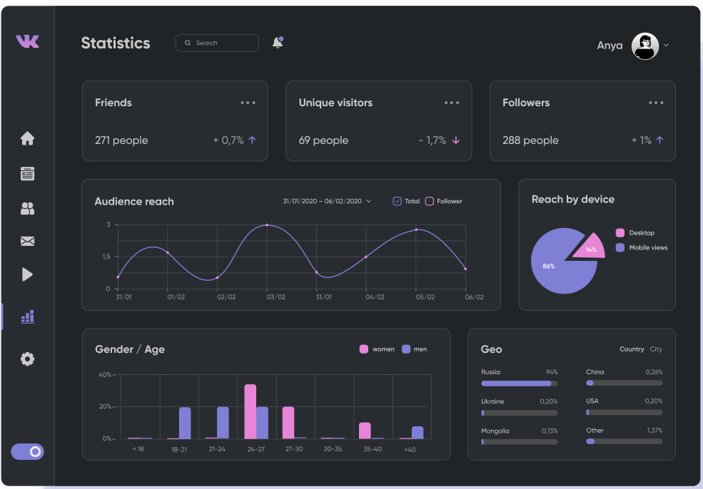
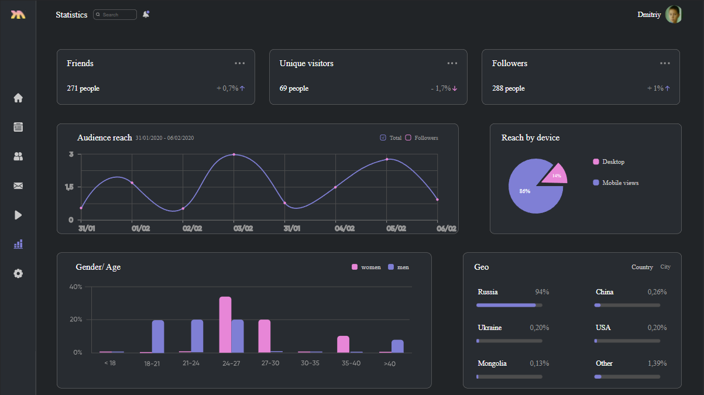
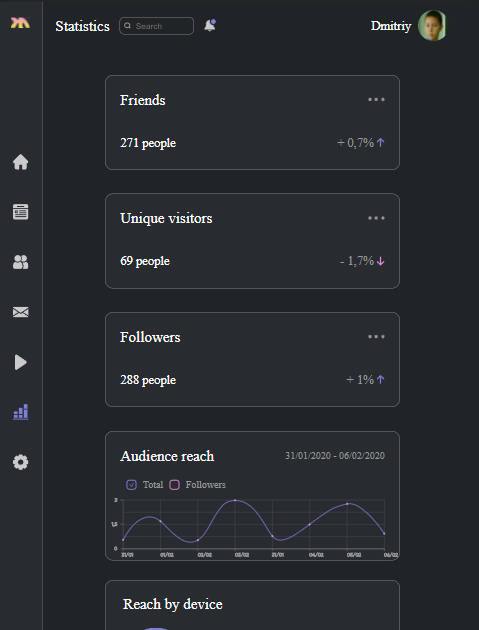

<p align = center>МИНИСТЕРСТВО НАУКИ И ВЫСШЕГО ОБРАЗОВАНИЯ

<p align = center>РОССИЙСКОЙ ФЕДЕРАЦИИ

<p align = center>ФЕДЕРАЛЬНОЕ ГОСУДАРСТВЕННОЕ БЮДЖЕТНОЕ ОБРАЗОВАТЕЛЬНОЕ УЧРЕЖДЕНИЕ ВЫСШЕГО ОБРАЗОВАНИЯ

<p align = center>«ВЯТСКИЙ ГОСУДАРСТВЕННЫЙ УНИВЕРСИТЕТ»

<p align = center>Институт математики и информационных систем

<p align = center>Факультет автоматики и вычислительной техники

<p align = center>Кафедра систем автоматизации управления
<br>
<br>
<br>
<br>

<p align = right>Дата сдачи на проверку:

<p align = right>«___» __________ 2022 г.

<p align = right>Проверено:

<p align = right>«___» __________ 2022 г.
<br>
<br>
<br>
<br>
<br>


<p align = center>Отчет по лабораторной работе № 4

<p align = center>по дисциплине

<p align = center>«Web-программирование»

<br>
<br>
<br>
<br>


<p align = center>Разработал студент гр. ИТб-2301-01-00 ________________ /Широков Д.Р./

<p align = center>Проверил ст. преподаватель _________________ /Земцов М.А./

<p align = center>Работа защищена с оценкой «___________» «___» __________ 2022 г.

<br>
<br>
<br>
<br>

<p align = center>Киров 2022

<hr>
Цель:  сверстать макета с помощью фреймворка Vue

Задачи:

1. Организовать процесс работы над лабораторной работой
1. Выбрать dashboard-макет в Figma Community
1. Сверстать dashboard-страницу, разбив её на компоненты Vue
1. Реализовать адаптивную верстку под мобильное устройство

Ход выполнения:

1. Организовать процесс работы над лабораторной работой

Для работы в репозитории *[ссылка на репозиторий](https://github.com/Gestroo/Web)* на сайте github.com была создана новая ветвь с названием lab4. В проект были добавлены компоненты dashboard.vue, topbar.vue, leftbar.Vue, main.vue. Листинг компоненита dashboard.vue представлен в приложении А.

2. Выбрать dashboard-макет в Figma Community

На электронном ресурсе с готовыми макетами Figma Community был выбран макет, представленный на рисунке 1.


<p align=center></p>

<p align = center>Рисунок 1 – Dashboard-макет 

3. Сверстать dashboard-страницу, разбив её на компоненты Vue

В ходе выполнения работы были выделены логические компоненты макета, а именно: leftbar, topbar, main. Листинги компонентов представлены в приложении Б, приложении В и приложении Г соответственно.

Реализованный макет представлен на рисунке 2.

<p align=center></p>

<p align = center>Рисунок 2 – Dashboard-макет для Desktop

<p align = center>2
<hr>

4. Реализовать адаптивную верстку под мобильное устройство

С помощью медиа запросов была реализована способность страницы адаптироваться под мобильные устройства. Результат продемонстрирован на рисунке 3.

<p align=center></p>

<p align = center>Рисунок 3 – Dashboard-макет для мобильных устройств


Вывод: в ходе лабораторной работы были закреплены навыки работы с фреймворком Vue. Реализован Dashboard-макет для компьютеров и мобильных устройств. 

<p align = center>3
<hr>


<p align = center>Приложение А

<p align = center>(обязательное) 

<p align = center>Листинг компонента dashboard.vue

```html
   <template>
  <div>
    <Leftbar></Leftbar>
    <Topbar></Topbar>
    <Main></Main>
  </div>
</template>

<script lang="ts">

import Vue from 'vue';
import Leftbar from './leftbar.vue';
import Main from './main.vue';
import Topbar from './topbar.vue';

export default Vue.extend({
  name: 'Dashboard',
  components: {
    Leftbar,
    Topbar,
    Main,
  },
});
</script>
```
<p align = center>4
<hr>

<p align = center>Приложение Б

<p align = center>(обязательное) 

<p align = center>Листинг компонента leftbar.vue

```html
<template>
  <div class="leftbar-div dark" id="app">
    <div class="left-menu dark">
      
      <div class="buttons">
        <button class="dark left-button">
          
        </button>
        <button class="dark left-button">
          
        </button>
        <button class="dark left-button">
          
        </button>
        <button class="dark left-button">
          
        </button>
        <button class="dark left-button">
          
        </button>
        <button class="dark left-button">
          
        </button>
        <button class="dark left-button">
          
        </button>
      </div>
    </div>
  </div>
</template>

<script lang="ts">
import Vue from 'vue';

export default Vue.extend({
  name: 'Leftbar',
});
</script>

<style scoped>
.leftbar-div {
  position: fixed;
  display:block;
width: 5%;
height: 100%;
border: 1px;
border-right-style: solid;
border-color:grey;
  }
.left-menu{
  margin: auto;
  display:flex;
  flex-direction:column;
align-items: center;
}
.buttons{
 margin: 170px auto;
  display:flex;
  flex-direction:column;
align-items: center;
  columns: 1;

}
.logo{
  width:40px;
  height:40px;
  margin-top: 18px;
  transform: scale(-1, -1);
}
.left-button{
  margin: 20px 0;
  width:40px;
  height:40px;
  border: none;
  cursor: pointer;
}
.dark{
background-color: #282c31 ;
color: #282c31;
}
@media (max-width:768px){
  .leftbar-div{
      position: fixed;
    display:block;
width: 9%;
height:100%;
}
  .logo{
 width:30px;
  height:30px;
}
  }
</style>
```
<p align = center>5
<hr>

<p align = center>Приложение В

<p align = center>(обязательное) 

<p align = center>Листинг компонента topbar.vue

```html
    <template>
    <div class='topbar-div dark'>
        <div class='left-div'>
            <p class ='header-text text'>Statistics</p>
            <div class='search-block'>
                
                <input type='text' class="search-input dark text" placeholder="Search">
            </div>
            
        </div>
        <div class= 'profile-div'>
            <p class="text profile-text">Dmitriy</p>
            
        </div>
    </div>
</template>

<script lang="ts">
import Vue from 'vue';

export default Vue.extend({
  name: 'Topbar',
});
</script>

<style scoped>
.topbar-div {
    justify-content: space-between;
  display:flex;
    width:95%;
    height:7%;
    margin-left: 5%;
}
.dark{
background-color: #212427 ;
color: #212427;
}
.header-text{
    font-size: 24px;

}
.search-block{
    margin-left: 5%;
    width:30%;
    outline: hidden;
}
.search-input{
    width: 70%;
    margin-top:24px;
    display:block;
    padding : 5px 25px;
    border: 1px solid gray;
    border-radius:8px;
}
.notification{
    margin-top:27px;
    margin-left:12%;
width: 20px;
height:20px;
}
.search-image{
    z-index: 5;
margin-top:32px;
margin-left:7px;
position:absolute
}
.left-div{
    display: flex;
    margin-left: 3%;
    }
.profile-div{
display: flex;
margin:auto 3% ;

    }
.profile-pic{
    margin:auto;
    width:50px;
    height:50px;
    border-radius:35px;
    margin-left:1%;
        }
.profile-text{
    margin-right: 10px;
    font-size:20px;
}
.text{
    color: #fff
}
@media(max-width:768px){
.topbar-div{
justify-content: space-between;
  display:flex;
  max-width:91%;
    width:91%;
    height:7%;
    margin-left: 9%;
}
.profile-div{
    display: flex;
    margin-right: 7%;
}
}
</style>

```
<p align = center>6
<hr>
<p align = center>Приложение Г

<p align = center>(обязательное) 

<p align = center>Листинг компонента main.vue

```html
   <template>
  <div class='main-div dark'>
    <div class='topline'>
        <div class='block-border block-color topblock'>
            <div class='jcfx'>
                <p class='header-text'>Friends</p>
                
            </div>
            <div class='jcfx'>
                <p class='header-subtext'>271 people </p>
                <div class="flex">
                    <p class='subtext'>+ 0,7%</p>
                    
                </div>
            </div>
        </div>
        <div class='block-border block-color topblock'>
            <div class='jcfx'>
                <p class='header-text'>Unique visitors</p>
                
            </div>
            <div class='jcfx'>
                <p class='header-subtext'>69 people </p>
                <div class="flex">
                    <p class='subtext'>- 1,7%</p>
                    
                </div>
            </div>
        </div>
        <div class='block-border block-color topblock'>
            <div class='jcfx'>
                <p class='header-text'>Followers</p>
                
            </div>
            <div class='jcfx'>
                <p class='header-subtext'>288 people </p>
                <div class="flex">
                    <p class='subtext'>+ 1%</p>
                    
                </div>
            </div>
        </div>
    </div>
    <div class='midline flex'>
        <div class ='block-border block-color mid-left'>
            <div class='audi-jcfx'>
                <div class="audi-flex">
                    <p class='header-text'>Audience reach</p>
                    <p class="subtext-mini date-text">31/01/2020 - 06/02/2020 </p>
                </div>
                <div class='checkboxes flex'>
                    
                    <p class="subtext-mini">Total</p>
                    
                    <p class="subtext-mini">Followers</p>
                </div>
            </div>
            <div>
                
            </div>
        </div>
        <div class=' block-border block-color mid-right'>
            <p class="header-text solo-text">Reach by device</p>
            <div class="flex">
                <div class="diagram">
                    
                    
                    <p class="subdiagram high-percent">86%</p>
                    <p class="subdiagram low-percent">14%</p>
                </div>
                <div class="legend">
                    <div class="flex">
                        
                        <p class="legend-text">Desktop</p>
                    </div>
                    <div class="flex">
                        
                        <p class="legend-text">Mobile views</p>
                    </div>
                </div>
            </div>
        </div>
    </div>
    <div class="botline">
        <div class="bot-left block-border block-color">
           <div class="jcfx">
               <p class="header-text">Gender/ Age</p>
               <div class="flex">
                   
                   <p class="gender-text ">women</p>
                   
                   <p class="gender-text ">men</p>
               </div>
            </div>
            <div>
                
            </div>
        </div>
        <div class="bot-right block-border block-color">
            <div class="jcfx">
                <p class="header-text">Geo</p>
                <div class="flex">
                    <p class= "gender-text">Country</p>
                    <p class="subtext-mini">City</p>
                </div>
            </div>
            <div class="jcfx geo-full">
                <div class="geo-half">
                    <div >
                        <div class="jcfx">
                            <p class="header-subtext">Russia</p>
                            <p class="subtext">94%</p>
                        </div>
                        
                    </div>
                    <div >
                        <div class="jcfx">
                            <p class="header-subtext">Ukraine</p>
                            <p class="subtext">0,20%</p>
                        </div>
                        
                    </div>
                    <div >
                        <div class="jcfx">
                            <p class="header-subtext">Mongolia</p>
                            <p class="subtext">0,13%</p>
                        </div>
                        
                    </div>
                </div>
               <div class="geo-half">
                    <div >
                        <div class="jcfx">
                            <p class="header-subtext">China</p>
                            <p class="subtext">0,26%</p>
                        </div>
                        
                    </div>
                    <div >
                        <div class="jcfx">
                            <p class="header-subtext">USA</p>
                            <p class="subtext">0,20%</p>
                        </div>
                        
                    </div>
                    <div >
                        <div class="jcfx">
                            <p class="header-subtext">Other</p>
                            <p class="subtext">1,39%</p>
                        </div>
                        
                    </div>
                </div>
            </div>
        </div>
    </div>
  </div>
</template>

<script lang="ts">
import Vue from 'vue';

export default Vue.extend({
  name: 'Main',
});
</script>

<style scoped>
.main-div{
    max-width: 95%;
    height:93%;
    margin-left: 5%;
    padding: 3%;
}
.midline{
    margin-top:3%;
}
.botline{
    display:flex;
    margin-top:3%;
}
.topline{
    width: 96%;
    display: grid;
      grid-template-columns: repeat(3, 33%);
    gap: 0 40px;
}
.block-color{
background-color: #282c31 ;
}
.geo-full{
    margin-bottom: 5%;
}
.percent-bar{
    height: 10px;
    width:90%;
    margin-bottom:10%;
}
.dark{
background-color: #212427 ;
color: #212427;
}
.arrow{
    margin-left:5px;
}
.flex{
    display:flex;
}
.geo-half{
    width:40%;
}
.header-text{
    color: #fff;
    font-size:24px;
}
.header-subtext{
    color: #fff;
    font-size:20px;
}
.block-border{
    border: 1px solid gray;
    border-radius:13px;
}
.bot-left{
    width:60%;
}
.jcfx{
    justify-content:space-between;
    display:flex;
    margin: 0 5%;
}
.audi-jcfx{
    justify-content:space-between;
    display:flex;
    margin: 0 5%;
}
.audi-flex{
    display:flex;
}
.topblock{
    height: 150px;
}
.graph{
    width:100%;
}
.check{
    width:16px;
    margin-left: 10px;
}
.diagram{
    position: relative;
    width: 50%;
    margin-right: 20px;
}
.solo-text{
    margin-left:6%;
}
.mid-left{
    width:65%;
}
.mid-right{
    width: 31%;
    margin-left:5%;
}
.subdiagram{
    position: absolute;
}
.subtext-mini{
  color:#979797;
    font-size:16px;
    margin:auto 0 auto 10px;
}
.date-text{
    margin-right:50px;
}
.purpledia{
    margin-top:20px;
    margin-left:50px;
    width:150px;

}
.pinkdia{
    margin-top:30px;
    margin-left:140px;
    width: 72px;
}
.high-percent{
    color:#fff;
    margin-top:100px;
    margin-left: 80px;
}
.low-percent{
    color:#fff;
    margin-top:60px;
    margin-left:170px;
    font-size: 13px;
}
.legend-text{
    color:#CACACA;
    margin-left:10px;
    font-size:18px;
}
.gender-text{
color:#CACACA;
margin:auto 10px;
font-size: 18px;
}
.stolbdia{
    width:95%;
    height:50%;
}
.bot-right{
    width:35%;
    margin-left:5%;
}
.subtext{
    color:#979797;
    font-size:20px;
}
@media(max-width:768px){
    .main-div{
    max-width: 91%;
    height:93%;
    margin-left: 9%;
    padding: 3%;
}
.topline{
    width: 96%;
    display: flex;
    flex-direction: column;
}
.topblock{
    width:75%;
    margin: 3% auto ;
}
.midline{
    width:96%;
    display:flex;
    flex-direction: column;
}
.mid-left{
    width:75%;
    margin: auto;
}
.graph{
    width:100%;
}
.mid-right{
    margin:5% auto;
    width:75%;
}
.purpledia{
    margin-top:0;
    margin-left:30px;
    width:100px;
}
.pinkdia{
    margin-top:5px;
    margin-left:100px;
    width: 48px;
}
.high-percent{
    color:#fff;
    margin-top:50px;
    margin-left: 50px;
}
.low-percent{
    color:#fff;
    margin-top:25px;
    margin-left:115px;
    font-size: 13px;
}
.diagram{
    position: relative;
    width: 45%;
}
.botline{
    display:flex;
    flex-direction:column;
    margin-top:3%;
    width:96%;
}
.bot-left{
    width: 75%;
    margin: 0 auto;
}
.bot-right{
    width:75%;
    margin: 5% auto;
}
.audi-jcfx{
    display:flex;
    flex-direction:column;
    margin: 0 5%;
}
.audi-flex{
display:flex;
justify-content: space-between;
}
.checkboxes{
margin-bottom:3%;
}
.date-text{
    margin:auto 0;
}
}
</style>

```
<p align = center>7
<hr>